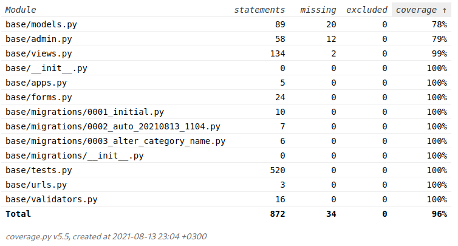
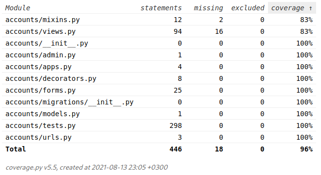

# Documentation
# Project title: Blog
# Table of contents:
- [Introduction](#introduction)
- [Overview](#overview)
- [Features](#features)
- [Additional](#additional)
- [Object specific information](#object-specific-information)  
- [Requirements](#requirements)
- [Tests Coverage](#tests-coverage)

## Introduction
The purpose of the document is to give a detailed description of the specific web project in terms of idea, goals, functionalities, requirements and others.
## Overview
The project is a small blogging application with some rudimentary features. Authors can write many posts. Posts are separated by categories. Each post can have one or more categories. Comments section is available beneath every post page.
## Features
- Extended user model.
- Cloud storage.
- Password change.
- Password reset via email.
- Pagination.
- Create, read, update and delete blog posts.
- Categorization of blog posts.
- Search blog posts by title, author or category.
- Search for category from list of categories.
- Create, read, update and delete comments for a given post.
- Post likes.
- CKeditor (rich text editor) available upon post content creation.
- Update user's own profile page.
- View other user's profiles.

## Additional
- Amazon AWS S3 cloud for uploading files such as profile pictures.

## Object specific information
### User model
- Not authenticated users have only get() (read) permissions. These include viewing the list of blog posts, the given post's details page with the related comments, viewing the author's profile page, performing all the search functionality and requesting email for password reset.
- Admin user has all the CRUD permissions by default upon the 'createsuperuser' command.
- Regular user (non staff & non superuser) has all the CRUD permissions over personal content and read permissions just like the non authenticated user over non-personal content.
### Comments model
- Comments model has ManyToOne relationships with an user model and a post model. Each post can have many comments and each user can write many comments to one or more posts.
- Fields:
  - author - ForeignKey relation with User model
  - name - CharField
  - content - TextField
  - post - ForeignKey relation with Post model
  - date_published - DateTimeField
  - date_modified - DateTimeField
### Post model
- A Post model has ManyToOne relationship with the user model in terms of the post author and ManyToMany relationship with the user model in terms of blog post likes. Each post can have only one author but an author can write many posts. Each post can have many comments but a comment can be assigned to only one post.
- Model fields:
  - title - CharField
  - author - ForeignKey relation with User model
  - content - RichTextField (ckEditor)
  - date_published - DateTimeField
  - category - ManyToManyField relation with Category model
  - likes - ManyToManyField relation with User model
  - snippet - CharField
- Custom Methods:
  - likes_count() - returns the number of the users who liked the post.
### Category
- As explained above, the Category model has a ManyToMany relationship with the Post model. It's purpose is to order and categorize posts so they can be easily searched.
- Model fields:
  - name - CharField
### Profile model
- Profile model's purpose is to extend the base user model's functionality by providing the user's to upload additional information about themselves such as profile picture, social media links, bio, birth date and location.
- A profile is automatically created upon successfull user registration by using django signals. OneToOneField relationship is implemented between the two classes.
- Model Fields:
  - user - OneToOneField relation with User model
  - profile_picture - ImageField
  - location - CharField
  - birth_date - DateField
  - bio - TextField
  - facebook_url - URLField
  - linkedin_url - URLField
  - instagram_url - URLField
  - twitter_url - URLField
  - github_url - URLField
- Custom Methods:
  - get_domain_name_url(), where domain_name = [facebook, instagram, github, twitter, linkedin]
  - get_profile_picture() - returns the path where the file is located.
  - get_absolute_url()
  - create_profile() - custom function implemented with django signals. sender=User
  - save_profile() - custom function implemented with django signals. sender=User
## Requirements
- Softuni project requirements:
- Mandatory
  - [x] The application must be implemented using Django Framework.
  - [x] The application must have at least 10 endpoints.
  - [x] The application must have login/register functionality.
  - [x] The application must have public part (A part of the website, which is accessible by everyone - un/authenticated users and admins).
  - [x] The application must have private part (accessible only by authenticated user and admins)
  - [x] The application must have admin part (accessible only to admins).
  - [x] Unauthenticated users (public part) have only get permissions e.g., lading page, details, about page.
  - [x] Authenticated users (private part) have full CRUD for all their created content.
  - [x] Admins have full CRUD functionalities.
  - [x] Form Validations.
  - [x] To avoid crashes, implement Error Handling and Data Validations.
  - [x] Use PostgreSQL as a database.
  - [x] Write tests for at least 60% coverage on your business logic.
  - [x] Templates (your controllers/views must return HTML files) - one and the same template could be re-used/used multiple times (with the according adjustments, if such needed).
  - [x] Use a source control system by choice - Github or Gitlab. You must have at least 5 commits + README.
- Optional
  - [ ] Responsive web design.
  - [x] Class-based views.
  - [x] Extended django user.
  - [x] Documentation/Swagger
  - [x] Use a file storage cloud API e.g., Cloudinary, Dropbox, Google Drive or other for storing the files.
  - [ ] Implement Microservice architecture in your application.
  - [ ] Additional functionality, not explicitly described in this section, will be counted as a bonus if it has practical usage.

## Tests Coverage
- Base app

- Accounts app

